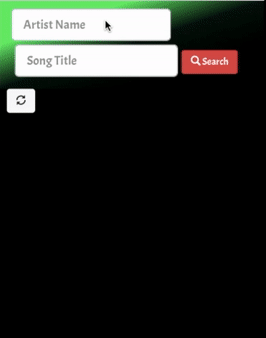

# lyrics-itune-app
## [Temporary Demo Link](http://lyricsfinder.surge.sh/) 

### A front-end react application that uses two third-party API's (lyrics and iTunes), that allows you to search for an artist and song title, then the lyrics and iTunes preview audio will appear.

### Softwares used:  
### React, Bootstrap, and Flexbox

### Demo: 

